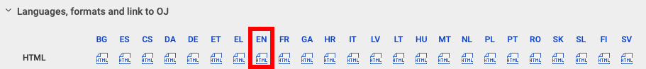

# EU Law Visualiser

A beautiful, interactive web application for reading and navigating European Union legal instruments. Built by [Konrad Kollnig](https://kollnig.net) at the [Law & Tech Lab, Maastricht University](https://www.maastrichtuniversity.nl/law-tech-lab).

## 🌐 Try It Now

**[Open the EU Law Visualiser](https://maastrichtlawtech.github.io/eur-lex-visualiser)**

## Features

- 📖 **Interactive Table of Contents**: Navigate through chapters, sections, and articles with an organized, collapsible structure
- 📝 **Recitals Viewer**: Quick access to all recitals with a grid-based navigation interface
- 📎 **Annexes Browser**: Easy browsing of supplementary materials and annexes
- 🔍 **Article Navigation**: Seamless navigation between articles, recitals, and annexes with Previous/Next controls
- 🔗 **Shareable Links**: Bookmark and share links to specific articles, recitals, or annexes
- 📱 **Responsive Design**: Works beautifully on desktop, tablet, and mobile devices

## How to Use

### Option 1: Use Pre-loaded Laws (No Extension Required)

Visit the [EU Law Visualiser](https://maastrichtlawtech.github.io/eur-lex-visualiser) and select from the pre-loaded legal instruments:

- **AI Act** (EU 2024/1689)
- **GDPR** (EU 2016/679) – Unconsolidated
- **DMA** (EU 2022/1925) – Unconsolidated
- **DSA** (EU 2022/2065)
- **Data Act** (EU 2023/2854)
- **Data Governance Act** (EU 2022/868)

Simply click on any law to open it in an interactive viewer with a table of contents, recitals, and annexes.

### Option 2: Visualize Any EU Law from EUR-Lex (Extension Required)

The visualiser can open **any EU law** (at least newer ones) directly from EUR-Lex. To use this feature, you need to install a browser extension.

#### Install the Browser Extension

[](https://chrome.google.com/webstore/detail/eur-lex-visualiser/akkfdjadggheloggnfonppfkbifanpbc)
[](https://chrome.google.com/webstore/detail/eur-lex-visualiser/akkfdjadggheloggnfonppfkbifanpbc)
[](https://chrome.google.com/webstore/detail/eur-lex-visualiser/akkfdjadggheloggnfonppfkbifanpbc)
[](https://addons.mozilla.org/en-US/firefox/addon/eur-lex-visualiser/)

- **Chrome, Brave, or Edge**: [Install from Chrome Web Store](https://chrome.google.com/webstore/detail/eur-lex-visualiser/akkfdjadggheloggnfonppfkbifanpbc)
- **Firefox**: [Install from Firefox Add-ons](https://addons.mozilla.org/en-US/firefox/addon/eur-lex-visualiser/)

#### Using the Extension

1. Install the extension for your browser (see links above).
2. Visit any EU law page on [EUR-Lex](https://eur-lex.europa.eu) — for example, the [GDPR](https://eur-lex.europa.eu/eli/reg/2016/679/oj/eng).
3. Use the EUR-Lex language selector to open the law in **English** (the parser currently requires the English version).
4. The extension automatically captures the page and opens it in the visualiser with the same interactive table of contents, recitals, and annexes.



> 💡 **Pro tip:** once the law has opened in the visualiser, bookmark the page to jump back to the same document later.

The extension works automatically—no need to click anything. Just browse EUR-Lex as usual, and when you visit a legal document page, it will open in the visualiser.

## Browser Support

The application works in most modern browsers:
- Chrome, Brave, Edge (Chromium-based browsers)
- Firefox
- Other modern browsers with ES6+ JavaScript support

## For Developers

### Installation

#### Prerequisites

- Node.js (v18 or higher recommended)
- npm or yarn

#### Setup

1. Clone the repository:
```bash
git clone https://github.com/maastrichtlawtech/eur-lex-visualiser.git
cd eu-law-visualiser
```

2. Install dependencies:
```bash
npm install
```

3. Start the development server:
```bash
npm run dev
```

4. Open your browser and navigate to `http://localhost:5173`

### Development Commands

- `npm run dev` – Start the development server with hot module replacement
- `npm run build` – Build the project for production
- `npm run preview` – Preview the production build locally
- `npm run lint` – Run ESLint to check code quality

### Adding New Pre-loaded Laws

To add a new legal instrument to the pre-loaded list:

1. Place the law file (XHTML, XML, or HTML) in the `public/data/` directory
2. Add an entry to `src/constants/laws.js`:
```javascript
{ key: "law-key", label: "Law Name (EU YYYY/XXXX)", value: "data/law-file.xhtml" }
```

The parser automatically handles:
- Official Journal (OJ) format
- Consolidated format
- JSON format (if pre-processed)

### Project Structure

```
eu-law-visualiser/
├── public/
│   └── data/              # Legal instrument files (XHTML, XML, HTML)
├── src/
│   ├── components/        # React components
│   │   ├── Accordion.jsx   # Collapsible accordion component
│   │   ├── Button.jsx      # Reusable button component
│   │   ├── Landing.jsx     # Landing page component
│   │   └── TopBar.jsx      # Top navigation bar
│   ├── constants/
│   │   └── laws.js         # Supported laws configuration
│   ├── utils/
│   │   ├── fetch.js        # HTTP fetch utilities
│   │   ├── parsers.js      # XHTML/XML parsing logic
│   │   └── url.js          # URL state management
│   ├── App.jsx             # Main application component
│   ├── main.jsx            # Application entry point
│   └── index.css           # Global styles
├── extension/              # Browser extension files
├── package.json
├── vite.config.js
└── README.md
```

### Tech Stack

- **React** – UI framework
- **Vite** – Build tool and dev server
- **Tailwind CSS** – Styling
- **Framer Motion** – Animations
- **Lucide React** – Icons

### How It Works

1. **Parsing**: The application parses EU legal documents (typically in XHTML format from EUR-Lex) to extract:
   - Articles (with chapter/section hierarchy)
   - Recitals
   - Annexes

2. **Navigation**: Users can navigate through the document using:
   - The table of contents (organized by chapters and sections)
   - Recital grid (numbered buttons)
   - Annex list
   - Previous/Next buttons in the top bar

3. **State Management**: The selected law and current view are synchronized with the URL, allowing for:
   - Bookmarkable links
   - Browser back/forward navigation
   - Direct linking to specific laws

4. **Extension Integration**: The browser extension captures HTML from EUR-Lex pages and passes it to the visualiser, which parses and displays it in the same interactive format.

## Contributing

Contributions are welcome! Please feel free to submit a Pull Request. For major changes, please open an issue first to discuss what you would like to change.

## License

This project is licensed under the GNU General Public License v3.0. See the [LICENSE](LICENSE) file for details.

## Credits

Built by **Konrad Kollnig** at the **Law & Tech Lab, Maastricht University**.

For questions or feedback, please contact [eu-law@trackercontrol.org](mailto:eu-law@trackercontrol.org).

## Acknowledgments

This project uses legal documents from EUR-Lex, the official database of EU law.
