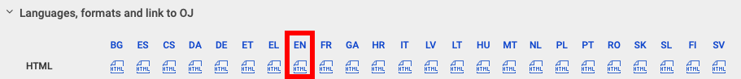

# LegalViz.EU

<p align="center">
  
</p>

A beautiful, interactive web application for reading and navigating European Union legal instruments. Built by [Konrad Kollnig](https://kollnig.net) at the [Law & Tech Lab, Maastricht University](https://www.maastrichtuniversity.nl/law-tech-lab).

## 🌐 Try It Now

**[Open LegalViz.EU](https://legalviz.eu)**

## ✨ Key Features

### 📖 Interactive Reading Experience
- **Smart Table of Contents**: Navigate through chapters, sections, and articles with an organized, collapsible structure.
- **Recitals Viewer**: Quick access to all recitals with a grid-based navigation interface.
- **Annexes Browser**: Easy browsing of supplementary materials and annexes.


### 🔍 Powerful Search & Navigation
- **Instant Search**: Full-text search across articles, recitals, and annexes.
- **Keyboard Shortcuts**: Press `Cmd+K` (Mac) or `Ctrl+K` (Windows) to jump to any section instantly.
- **Deep Linking**: Share exact locations in the text. URLs automatically update as you scroll or navigate.
- **Article Navigation**: Seamlessly move between articles with Previous/Next controls.

### 🤖 AI-Powered Context
- **Related Recitals**: The tool automatically analyzes the text to find connections between articles and recitals.
- **Inline Context**: View relevant recitals side-by-side with articles to better understand the legislative intent.
- **Definitions Context**: Automatically highlights defined terms (e.g., "online platform") and shows their legal definition on hover.
- **TF-IDF Analysis**: Uses transparent, client-side text analysis (TF-IDF & Cosine Similarity) to suggest relationships without external API calls.

### 🎨 Design & Accessibility
- **Dark Mode**: Fully supported dark theme that respects system settings.
- **Responsive Design**: Optimized for reading on desktop, tablet, and mobile devices.

### 🖨️ Professional Export
- **Customizable Printing**: Create clean, print-ready documents or PDFs.
- **Selective Export**: Choose exactly what to include—Articles, Recitals, Annexes, or specific combinations.
- **Inline Context in PDF**: Option to include "Related Recitals" directly next to articles in the printed output.

### 🌐 Browser Extension
- **Universal Support**: Open recent EU laws directly from EUR-Lex using the browser extension.
- **Direct Import Flow**: The extension sends the current EUR-Lex URL to LegalViz through the existing `/import?...` compatibility entrypoint.
- **Lightweight Design**: The extension does not capture or store full HTML pages locally.
- **Canonical Imports**: Once resolved, LegalViz redirects imported laws to clean canonical URLs like `/gdpr` or `/regulation-2018-1972`.

## How to Use

### Option 1: Use Pre-loaded Laws (No Extension Required)

Visit [LegalViz.EU](https://legalviz.eu) and select from the pre-loaded legal instruments:

- **AI Act** (EU 2024/1689)
- **GDPR** (EU 2016/679) – Unconsolidated
- **DMA** (EU 2022/1925) – Unconsolidated
- **DSA** (EU 2022/2065)
- **Data Act** (EU 2023/2854)
- **Data Governance Act** (EU 2022/868)

### Option 2: Visualize Any EU Law from EUR-Lex (Extension Required)

The visualiser can open **any EU law** (at least newer ones) directly from EUR-Lex. To use this feature, you need to install a browser extension.

#### Install the Browser Extension

[](https://chrome.google.com/webstore/detail/eur-lex-visualiser/akkfdjadggheloggnfonppfkbifanpbc)
[](https://chrome.google.com/webstore/detail/eur-lex-visualiser/akkfdjadggheloggnfonppfkbifanpbc)
[](https://chrome.google.com/webstore/detail/eur-lex-visualiser/akkfdjadggheloggnfonppfkbifanpbc)
[](https://addons.mozilla.org/en-US/firefox/addon/eur-lex-visualiser/)

- **Chrome, Brave, or Edge**: [Install from Chrome Web Store](https://chrome.google.com/webstore/detail/eur-lex-visualiser/akkfdjadggheloggnfonppfkbifanpbc)
- **Firefox**: [Install from Firefox Add-ons](https://addons.mozilla.org/en-US/firefox/addon/eur-lex-visualiser/)

#### Using the Extension

1. Install the extension for your browser (see links above).
2. Visit any EU law page on [EUR-Lex](https://eur-lex.europa.eu) — for example, the [GDPR](https://eur-lex.europa.eu/eli/reg/2016/679/oj/eng).
3. Use the EUR-Lex language selector to open the law in **English** (the parser currently requires the English version).
4. On supported EUR-Lex text pages, the extension opens LegalViz and passes the current EUR-Lex URL for server-side resolution.
5. LegalViz resolves that URL to the canonical law URL for the act, while keeping the extension’s import entry URL compatible.



> 💡 **Note:** the extension no longer stores a separate local library. It delegates resolution to the backend via the compatible `/import?...` entrypoint, and LegalViz then redirects to the canonical clean law URL.

## Browser Support

The application works in most modern browsers:
- Chrome, Brave, Edge (Chromium-based browsers)
- Firefox
- Other modern browsers with ES6+ JavaScript support

## For Developers

### Installation

#### Prerequisites

- Node.js (v18 or higher recommended)
- npm or yarn

#### Setup

1. Clone the repository:
```bash
git clone https://github.com/maastrichtlawtech/eur-lex-visualiser.git
cd eu-law-visualiser
```

2. Install dependencies:
```bash
npm install
```

3. Start the development server:
```bash
npm run dev
```

4. Open your browser and navigate to `http://localhost:5173`

### Development Commands

- `npm run dev` – Start the development server with hot module replacement
- `npm run build` – Build the project for production
- `npm run preview` – Preview the production build locally
- `npm run lint` – Run ESLint to check code quality

### Adding New Pre-loaded Laws

To add a new legal instrument to the pre-loaded list:

1. Place the law file (XHTML, XML, or HTML) in the `public/data/` directory
2. Add an entry to `src/constants/laws.js`:
```javascript
{ key: "law-key", label: "Law Name (EU YYYY/XXXX)", value: "data/law-file.xhtml" }
```

The parser automatically handles:
- Official Journal (OJ) format
- Consolidated format
- JSON format (if pre-processed)

### Project Structure

```
legalviz.eu/
├── public/
│   └── data/              # Legal instrument files (XHTML, XML, HTML)
├── src/
│   ├── components/        # React components
│   │   ├── Accordion.jsx   # Collapsible accordion component
│   │   ├── Landing.jsx     # Landing page
│   │   ├── LawViewer.jsx   # Main document viewer
│   │   ├── PrintModal.jsx  # Printing configuration
│   │   ├── RelatedRecitals.jsx # AI context viewer
│   │   └── TopBar.jsx      # Navigation & Search
│   ├── constants/
│   │   └── laws.js         # Supported laws configuration
│   ├── utils/
│   │   ├── nlp.js          # TF-IDF & Search logic
│   │   ├── parsers.js      # XHTML/XML parsing logic
│   │   └── url.js          # URL state management
│   ├── App.jsx             # Main application component
│   └── main.jsx            # Application entry point
├── extension/              # Browser extension files
├── package.json
└── README.md
```

### Tech Stack

- **React** – UI framework
- **Vite** – Build tool and dev server
- **Tailwind CSS** – Styling
- **Framer Motion** – Animations
- **Lucide React** – Icons

### How It Works

1. **Parsing**: The application parses EU legal documents (typically in XHTML format from EUR-Lex) to extract structure (Articles, Chapters, Sections), Recitals, and Annexes.
2. **Indexing**: A client-side inverted index is built on the fly to enable instant full-text search.
3. **Analysis**: The `nlp.js` module computes TF-IDF vectors for all articles and recitals to find semantic similarities, linking recitals to relevant articles automatically.
4. **State Management**: The selected law and current view are synchronized with the URL, allowing for bookmarkable links and browser back/forward navigation.
5. **Extension Integration**: The browser extension detects supported EUR-Lex pages and opens LegalViz with the full EUR-Lex `sourceUrl`.
6. **URL Resolution**: The backend resolves the EUR-Lex URL to a canonical CELEX identifier, and the app redirects from the compatible `/import?...` entrypoint to the canonical public law URL.

## Contributing

Contributions are welcome! Please feel free to submit a Pull Request. For major changes, please open an issue first to discuss what you would like to change.

## License

This project is licensed under the GNU General Public License v3.0. See the [LICENSE](LICENSE) file for details.

## Credits

Built by **Konrad Kollnig** at the **Law & Tech Lab, Maastricht University**.

For questions or feedback, please contact [eu-law@trackercontrol.org](mailto:eu-law@trackercontrol.org).

## Acknowledgments

This project uses legal documents from EUR-Lex, the official database of EU law.
